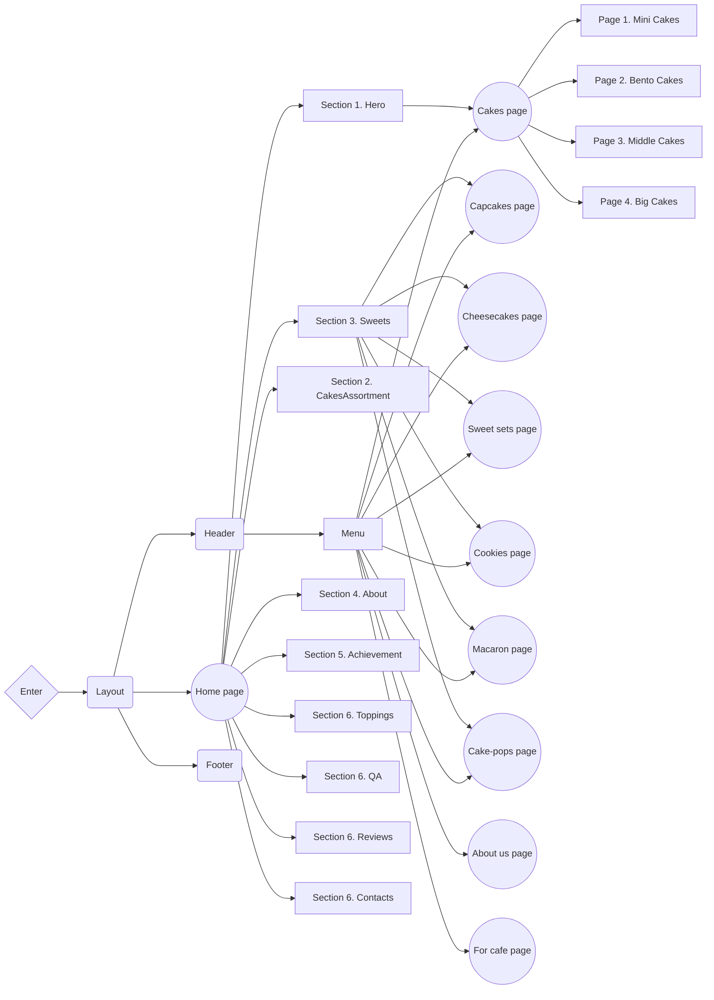

# DE-TORT :birthday::cupcake::chocolate_bar:

**[VIEW LIVE PAGE](https://de-tort.vercel.app)**

---

## 📝 Project description

A website for the **De-Tort** service company.

- **Project name**: De-Tort
- **Project goals**:
  - Creating a positive personal brand image
  - Attracting new customers / partners
  - Promoting services through website
  - Informing consumers
- **Target audience**:
  - **Age**: 20-45+
  - **Gender**: Female/Male
- **Product scope**: Development of a multi-page website for the De-Tort company,
  whose main field of activity is creating cakes, cookies, cheesecake, cupcake,
  sweet sets and other sweets for personal consumption, parties and events.

## 🛠️ Creating the project

**De-Tort** is a [Next.js](https://nextjs.org/) project bootstrapped with
[`create-next-app`](https://github.com/vercel/next.js/tree/canary/packages/create-next-app).

### Features

- **Optimization**: The website is optimized for fast loading, providing users
  with quick access to information.
- **Modularity and reusability**: The product is built using a component
  approach, which makes the code modular and allows components to be used on
  different pages and in different sections of the project. This simplifies the
  maintenance of the site and the expansion of its functionality.
- **Linters and formatting**: Using tools like Prettier and ESLint helps
  maintain code standards, ensures a consistent style, and identifies potential
  problems in the code.
- **Adaptability**: The website is responsive, allowing you to create dynamic
  and interactive user interfaces without reloading pages. This increases user
  engagement and interaction.
- **Convenient content management**: The content management system has an
  intuitive interface that simplifies the process of updating and editing
  content. You can easily make changes to texts, images and other content
  without special knowledge in web development.
- **Accessibility**:
  - Intuitive design
  - Semantic HTML
  - Mobile-friendly interface
  - Web resource available for any internet connection\

### Supported Languages

- Ukrainian

### Design

[Design layout on Figma](https://www.figma.com/file/NuYeBIX57JuRDvX95kwER0/De-Tort?type=design&node-id=323-6219&mode=design&t=kOBpPpQyvex6Vg72-0)

### Project structure

### Components API

Each component has its own API. You can find it in the component's folder. This
is a list of more common components and their API.

- #### ExampleComponent

| Prop        | Default     | Description                                   |
| ----------- | ----------- | --------------------------------------------- |
| `text`      | `undefined` | required, inner text content                  |
| `className` | `''`        | add custom or additional css class you'd need |

- #### LinkButton

| Prop                                                  | Default     | Description                                    |
| ----------------------------------------------------- | ----------- | ---------------------------------------------- |
| `label`                                               | `undefined` | required, inner button text content            |
| `secondaryLabel`                                      | `undefined` | optional, inner button additional text content |
| `href`                                                | `undefined` | required, The path or URL to navigate to.      |
| `className`                                           | `''`        | add custom or additional css class you'd need  |
| can also take any NextJS Link component standart prop |

- #### SectionTitle

| Prop        | Default     | Description                                                            |
| ----------- | ----------- | ---------------------------------------------------------------------- |
| `text`      | `undefined` | required, inner text content                                           |
| `hero`      | `false`     | to render `h1` element instead of default `h2` with appropriate styles |
| `className` | `''`        | add custom or additional css class you'd need                          |

- #### ContactsList

| Prop        | Default  | Description                                                     |
| ----------- | -------- | --------------------------------------------------------------- |
| `variant`   | `header` | required, choose between `header`, `footer` and `phone` version |
| `className` | `''`     | add custom or additional css class you'd need                   |

- #### ReviewCard

| Prop     | Default     | Description                  |
| -------- | ----------- | ---------------------------- |
| `author` | `undefined` | required, review author name |
| `date`   | `undefined` | required, review date        |
| `text`   | `undefined` | required, review text        |

- #### Contacts

| Prop      | Default | Description                                 |
| --------- | ------- | ------------------------------------------- |
| `variant` | `home`  | optional, choose between "home" and "cakes" |

- #### FormCakes

| Prop       | Default   | Description                          |
| ---------- | --------- | ------------------------------------ |
| `slug`     | undefined | required, the slug of a current page |
| `toppings` | undefined | required, the array of toppings      |

- #### CakesOrderForm

| Prop       | Default   | Description                          |
| ---------- | --------- | ------------------------------------ |
| `slug`     | undefined | required, the slug of a current page |
| `toppings` | undefined | required, the array of toppings      |

# Field Component

The `Field` component is a versatile form field wrapper used to render various input types, such as text, calendar, topping selection, number, and textarea.

## Props

| Prop          | Type      | Description                                                                                                |
| ------------- | --------- | ---------------------------------------------------------------------------------------------------------- |
| `register`    | Function  | A function from a form library (e.g., React Hook Form) used to register the input field in the form state. |
| `name`        | String    | The unique name for the input field.                                                                       |
| `control`     | Object    | An object representing the form control (e.g., from React Hook Form) to manage the input field's state.    |
| `label`       | String    | The label for the input field.                                                                             |
| `placeholder` | String    | The placeholder text for the input field.                                                                  |
| `type`        | FieldType | The type of the input field (e.g., "calendar," "topping," "textarea," "tel," "text," "number").            |
| `error`       | Object    | An object containing validation errors for the input field.                                                |
| `isDisabled`  | Boolean   | Indicates whether the input field is disabled.                                                             |
| `isOptional`  | Boolean   | Indicates whether the input field is optional.                                                             |
| `toppings`    | Array     | An array of CakeToppingType for the "topping" type input field.                                            |

- #### AboutCard

| Prop       | Default     | Description                                        |
| ---------- | ----------- | -------------------------------------------------- |
| `imageUrl` | `undefined` | required, url of the Image at the card             |
| `imageAlt` | `undefined` | required, alt of the Image at the card             |
| `text`     | `undefined` | required, text for the card                        |
| `isEven`   | `undefined` | required, true if current curd is even is the list |

- #### Logo

| Prop        | Default | Description                                   |
| ----------- | ------- | --------------------------------------------- |
| `className` | `''`    | add custom or additional css class you'd need |

- #### MenuButton

| Prop        | Default | Description                                   |
| ----------- | ------- | --------------------------------------------- |
| `className` | `''`    | add custom or additional css class you'd need |

- #### BurgerMenu

| Prop      | Default     | Description                                       |
| --------- | ----------- | ------------------------------------------------- |
| `isOpen`  | `undefined` | required, `boolean` - current state of element    |
| `onClose` | `undefined` | required, `:void` - event-handler on closing menu |

- #### MainNav

| Prop      | Default     | Description                                                                  |
| --------- | ----------- | ---------------------------------------------------------------------------- |
| `onClick` | `undefined` | required, `:void` - click-handler for additional effects on navigation links |

- #### MapLink

| Prop        | Default | Description                                   |
| ----------- | ------- | --------------------------------------------- |
| `className` | `''`    | add custom or additional css class you'd need |

- #### AccordionItem

| Prop        | Default     | Description                                                |
| ----------- | ----------- | ---------------------------------------------------------- |
| `item`      | `undefined` | required, item should includes - id, question and answer   |
| `isActive`  | `undefined` | required, `number` - current index of active element       |
| `setActive` | `undefined` | required, `:void` - click-handler for toggle AccordionItem |

- #### InfoButton

| Prop        | Default     | Description                                   |
| ----------- | ----------- | --------------------------------------------- |
| `label`     | `undefined` | required, button inner text-content           |
| `data`      | `undefined` | required, data for modal window inside button |
| `className` | `''`        | add custom or additional css class you'd need |

- #### Slider

| Prop               | Default     | Description                                                                 |
| ------------------ | ----------- | --------------------------------------------------------------------------- |
| `section`          | `undefined` | required, choose between `achievements`, `toppings`, `cakes` and `feedback` |
| `slides`           | `undefined` | required, `array` of slides                                                 |
| `customSlideClass` | `''`        | add custom or additional css class you'd need for slide                     |
| `customClass`      | `''`        | add custom or additional css class you'd need for the whole slider          |

- ### SliderNav

| Prop        | Default     | Description                                                                 |
| ----------- | ----------- | --------------------------------------------------------------------------- |
| `section`   | `undefined` | required, choose between `achievements`, `toppings`, `cakes` and `feedback` |
| `className` | `''`        | add custom or additional css class you'd need for the whole slider          |

- #### SweetsList

| Prop   | Default     | Description                                                               |
| ------ | ----------- | ------------------------------------------------------------------------- |
| `slug` | `undefined` | required, `string` variable to manage list structure & items title styles |

- #### SweetsCard

| Prop         | Default     | Description                               |
| ------------ | ----------- | ----------------------------------------- |
| `name`       | `undefined` | required, sweets name                     |
| `nameColor`  | `undefined` | required, sweet color                     |
| `bgSrc`      | `undefined` | required, sweet image src                 |
| `bgAlt`      | `undefined` | required, sweet image alt                 |
| `targetHref` | `undefined` | required, on click target Href            |
| `titleClass` | `undefined` | required, ocustom or additional css class |

- #### CardCakes

| Prop    | Default     | Description                         |
| ------- | ----------- | ----------------------------------- |
| `title` | `undefined` | required, title type of Cake        |
| `slug`  | `undefined` | required, link on right page        |
| `bgSrc` | `undefined` | required, cake image src            |
| `tbSrc` | `undefined` | required, cake image src for tablet |

- #### ToppingCard

| Prop        | Default     | Description                         |
| ----------- | ----------- | ----------------------------------- |
| `label`     | `undefined` | required, topping name              |
| `src`       | `undefined` | required, path to topping image     |
| `alt`       | `undefined` | required, topping image alt         |
| `idx`       | `undefined` | required, idx of card               |
| `className` | `''`        | optional, if need change card class |

- #### CloseButton

| Prop        | Default     | Description                                        |
| ----------- | ----------- | -------------------------------------------------- |
| `ariaLabel` | `undefined` | required, `string` - accessibility attribute value |
| `onClick`   | `undefined` | required, `:void` - event-handler on button click  |
| `className` | `''`        | add custom or additional css class you'd need      |

- #### ScrollBtn

| Prop         | Default     | Description                                                                   |
| ------------ | ----------- | ----------------------------------------------------------------------------- |
| `label`      | `undefined` | required, `string` - button's text                                            |
| `targetName` | `undefined` | required, `string` - The line indicates to which section to scroll the screen |
| `className`  | `''`        | add custom or additional css class you'd need                                 |

- #### SliderCakeCard

| Prop        | Default     | Description                                   |
| ----------- | ----------- | --------------------------------------------- |
| `src`       | `undefined` | required, `string`- path to cake image        |
| `alt`       | `undefined` | required, `string` - cake image alt           |
| `className` | `''`        | add custom or additional css class you'd need |

- #### ToppingModalCard

| Prop           | Default     | Description                                                                  |
| -------------- | ----------- | ---------------------------------------------------------------------------- |
| `onClick`      | `undefined` | required, `:void` - event-handler on button click                            |
| `name`         | `undefined` | required, `string`- title of type topping cake                               |
| `description`  | `undefined` | required, `string` - contain description of topping                          |
| `price_double` | `undefined` | required, `string` - describe price to weight ratio                          |
| `plate`        | `undefined` | required, `array` - contain different types toppings                         |
|                |             | with "double" or "single" layers, in object of array should contain url,desc |
|                |             | and layers: "single" or "double"                                             |

- #### Modal

| Prop             | Default     | Description                                                        |
| ---------------- | ----------- | ------------------------------------------------------------------ |
| `isOpen`         | `undefined` | required, `boolean` - current state of element                     |
| `onClose`        | `undefined` | required, `:void` - event-handler on closing menu                  |
| `children`       | `undefined` | add component for locating into modal window                       |
| `classNameWrap`  | `""`        | add custom or additional css class you'd need for wrapper of modal |
| `classNameModal` | `""`        | add custom or additional css class you'd need for modal            |

### Technology stack

- **Main technologies**:

  - Next.js (app router)
  - TypeScript
  - Tailwind CSS
  - Strapi

- **Additional dependencies**:

  - Swiper

  ...full list of dependencies is available in `package.json` file.

  ## 📂 Deployment

To deploy this project, you need to perform the following steps:

1. **Clone the repository**: Use the `git clone` command to clone this
   repository to your computer.
2. **Install the dependencies**: Open a terminal in the root of the project and
   run `npm install` or `yarn install` to install all required dependencies.
3. **Setting environment variables**: Create a `.env` file in the root folder
   and add the necessary environment variables that you need for the project
   according to the `.env.example` file.
4. **Run the application**: Run the `npm run dev` or `yarn dev` command to run
   the project on the local server.
5. **Deploy**: To deploy this project to a production server, use hosting
   platforms such as Vercel, Netlify, or others.

## ☎️ Contacts

**SoftRyzen** is ready to answer your questions and provide additional
information:

- **Website**: [softryzen.com](https://softryzen.com/)
- **Phone**: <a href="tel:+380979769625">+380979769625</a>
- **Email**: [services@softryzen.com](mailto:services@softryzen.com)
- **YouTube channel**:
  [https://www.youtube.com](https://www.youtube.com/watch?v=_X7NLwgdfgI)
